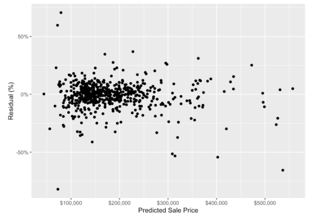

<link rel="stylesheet" type="text/css" href="include/style.css">

<!-- From https://stackoverflow.com/a/37839683/1297830 -->
<link rel="stylesheet" type="text/css" href="include/hideOutput.css">
<script src="include/hideOutput.js"></script>

© José Rafael Caro Barrera ([github](https://github.com/jrcarob)).<br />
Última actualización: 15 Junio, 2020 (Ver [changelog](https://github.com/jrcarob)).<br />
Versión en Python (en desarrollo)

<!-- Social sharing. From simplesharebuttons.com -->
<style type="text/css">
  #share-buttons img {
    width: 40px;
    padding-right: 15px;
    border: 0;
    box-shadow: 0;
    display: inline;
    vertical-align: top;
  }
</style>

<div id="share-buttons">
<!-- Twitter --><script async src="https://platform.twitter.com/widgets.js" charset="utf-8"></script><a href="https://twitter.com" class="twitter-hashtag-button" data-size="large" data-related="jrcaro" data-show-count="false">Compartir en Twitter</a> &nbsp;&nbsp;&nbsp;<!-- Email --><a href="mailto:?Subject=Predicción con XGBoost&amp/"></a>
</div>

<br />

```{r echo=FALSE}
# Options for building this document
knitr::opts_chunk$set(
  fig.height = 4,
  fig.width = 6,
  fig.align = 'center',
  message = FALSE,
  warning = FALSE
)

#devtools::install_github("jumpingrivers/headR")
headR::add_twitter_card(
  card_type = "summary_large_image",
  title = "Common statistical tests are linear models (or: how to teach stats)",
  user = "@jonaslindeloev",
  image = "https://lindeloev.github.io/tests-as-linear/linear_tests_cheat_sheet.png",
  file = "include/twitter_card.html"
)

# To show tables.
print_df = function(D,
                    decimals = 4,
                    navigate = FALSE) {
  DT::datatable(
    mutate_if(D, is.numeric, round, decimals),
    rownames = FALSE,
    options = list(
      searching = FALSE,
      lengthChange = FALSE,
      ordering = FALSE,
      autoWidth = TRUE,
      bPaginate = navigate,
      bInfo = navigate,
      paging = navigate
    )
  )
}
```

# Introducción al algoritmo XGBoost

XGBoost, abreviatura de *Extreme Gradient Boosting*, es uno de los algoritmos de _machine learning_ de tipo supervisado más usados en la actualidad y que utiliza el principio del _boosting_. 

El aprendizaje supervisado es aquel que tiene variables de entrada $(x)$ y una variable de salida $(Y)$ y utiliza un algoritmo para aprender la función de mapeo de la entrada a la salida $$Y=f(X)$$ El objetivo es aproximar la función de mapeo lo más precisa posible tal que cuando tenga nuevos datos de entrada $(x)$ se puedan predecir las variables de salida $(Y)$ para esos datos.

Se llama aprendizaje supervisado porque el proceso de un algoritmo que aprende del conjunto de datos de capacitación puede considerarse como un maestro que supervisa el proceso de aprendizaje. Conocemos las respuestas correctas, el algoritmo realiza predicciones de forma iterativa sobre los datos de entrenamiento y es corregido por el profesor. El aprendizaje se detiene cuando el algoritmo alcanza un nivel aceptable de rendimiento.

Los problemas de aprendizaje supervisados pueden agruparse en problemas de regresión y clasificación.

$\bullet$ **Clasificación:** Un problema de clasificación es cuando la variable de salida es una categoría, como "rojo" o "azul" o "enfermedad" y "sin enfermedad".

$\bullet$ **Regresión:** Un problema de regresión es cuando la variable de salida es un valor real, como "euros" o "kilogramos".
Algunos tipos comunes de problemas construidos sobre la clasificación y la regresión incluyen la recomendación y la predicción de series de tiempo, respectivamente. Algunos ejemplos populares de algoritmos supervisados de aprendizaje automático son:

***Regresión lineal*** para problemas de regresión.

***Random forest*** para problemas de clasificación y regresión.

***Support vector machine*** para problemas de clasificación.

El algoritmo *xgboost* es similar al *gradient boosting* pero más eficiente. Tiene soluciones de modelos lineales y algoritmos de aprendizaje en árbol y es al menos 10 veces más rápido que las implementaciones existentes del *gradient boosting*. Es compatible con varias funciones objetivas, incluida la regresión, clasificación y clasificación. y lo que lo hace rápido es su capacidad para hacer cálculos paralelos en una sola máquina.

En términos de eficiencia, precisión y factibilidad es más potente que el algoritmo _random forest_, por ejemplo o una red neuronal y dado que tiene un poder predictivo muy alto pero una implementación relativamente lenta, el _xgboost_ se convierte en una opción idónea para resolver la mayoría de los problemas de regresión, clasificación y clasificación, así como las funciones objetivas creadas por el usuario. También tiene características adicionales para hacer validación cruzada y encontrar aquéllas variables más importantes por lo que lo hace interesante para modelos de **credit scoring**, **reclamaciones de seguros**, o donde hay muchos parámetros que deben controlarse para optimizar el modelo.

Como se puede observar en el siguiente gráfico (1), el modelo XGBoost tiene la mejor combinación de rendimiento de predicción y tiempo de procesamiento en comparación con otros algoritmos.

***

[](performance.png)

***

Chollet y Allaire, (2018) (2) resumen el valor de XGBoost como sigue:

> "*XGBoost* se usa para problemas donde hay la disponibilidad de datos estructurados es muy amplia, mientras que el *deep learning* se usa para problemas de percepción como la clasificación de imágenes. Los usuarios de la primera casi siempre usan la biblioteca XGBoost."

> "Estas son las dos técnicas con las que se debería estar más familiarizado para tener éxito en el aprendizaje automático aplicado hoy: máquinas de aumento de gradiente, para problemas de aprendizaje superficial; y aprendizaje profundo, para problemas de percepción. En términos técnicos, esto significa que se deberá estar familiarizado con XGBoost y Keras."

> `r tint::quote_footer('-- Francoise Chollet y J.J. Allaire')`

Originalmente, XGBoost es una librería escrita en C++ y exportada a **R** en el paquete `xgboost` en nuestro caso, se ha entrenado el modelo XGBoost usando el paquete en **R** `caret`(3).

# Objetivos y preparación de los datos

En este post y avance preliminar de proyecto con aplicación a datos al mercado inmobiliario español se entrena y pone a punto un modelo basado en el algoritmo XGBoost usando la librería *tidymodels* de `R`. Para ello y como fuente de datos usamos el dataset  [AmesHousing](https://cran.r-project.org/web/packages/AmesHousing/AmesHousing.pdf) (4) que contiene datos de 82 variables para 2.930 propiedades en el condado de Ames, Iowa. Nuestro modelo intentará predecir el precio de venta de la vivienda.

<div class='fold s'>
```{r, message=FALSE, warning=FALSE, results='hide'}
# carga de los datos
library(AmesHousing)

# librerías para la limpieza  y preparación de los datos
library(janitor)
library(dplyr)

# carga de los paquetes necesarios
library(rsample)
library(recipes)
library(parsnip)
library(tune)
library(dials)
library(workflows)
library(yardstick)

# aceleración de los cálculos con procesamiento paralelo (opcional pero útil)
library(doParallel)
all_cores <- parallel::detectCores(logical = FALSE)
registerDoParallel(cores = all_cores)
```
</div>

### Carga de los datos a modelizar

<div class='fold s'>
```{r, message=FALSE, warning=FALSE, results='hide'}
# fijamos la semilla aleatoria set.seed() para que los resultados 
# sean replicables y así podemos reproducir cualquier simulación.
set.seed(1234)

# carga de los datos y limpieza de los nombres
ames_data <- make_ames() %>%
  janitor::clean_names()
```
</div>

# Proceso XGBoost

## Paso 0: Análisis Exploratorio de Datos.

En este punto inicial, haríamos resúmenes de los datos y algunos gráficos simples para obtener una comprensión lo más detallada posible de los datos. Para simplificar, vamos a omitir este paso pero, en un análisis del mundo real, comprender los problemas comerciales y hacer un EDA efectivo son a menudo los aspectos cruciales que requieren más tiempo y análisis.

## Paso 1: División de los Datos.

Ahora dividimos los datos en datos de entrenamiento y prueba. Los datos de entrenamiento se utilizan para el entrenamiento del modelo y el ajuste de hiperparámetros. Una vez entrenado, el modelo se puede evaluar contra los datos de prueba para evaluar la precisión. Normalmente se suelen utilizar un 80% de los datos para el entrenamiento del modelo, mientras que la simulación o test se hace con el 20% restante.

<div class='fold s'>
```{r, message=FALSE, warning=FALSE, results='hide'}
# División de los datos para entrenamiento y prueba. Estratificación por el precio de venta.
ames_split <- rsample::initial_split(
  ames_data, 
  prop = 0.8, 
  strata = sale_price
)
```
</div>

## Paso 2: Pre-procesamiento.

El preprocesamiento altera los datos para hacer que nuestro modelo sea más predictivo y el proceso de capacitación requiera menos cálculos computacionales. Muchos modelos requieren un preprocesamiento variable cuidadoso y extenso para producir predicciones precisas. Sin embargo, XGBoost es más robusto frente a datos muy asimétricos y/o correlacionados, por lo que la cantidad de preprocesamiento requerido con XGBoost es mínima. Sin embargo, todavía podemos hacer uso de algunos preprocesamientos, además, en R, con las librerías que `tidymodels` usa, utilizamos el paquete `recipes` para definir estos pasos de preprocesamiento anteriormente mencionados:

<div class='fold s'>
```{r, message=FALSE, warning=FALSE, results='hide'}
# "receta" de preprocesamiento
preprocessing_recipe <- 
  recipes::recipe(sale_price ~ ., data = training(ames_split)) %>%
  # conversión de variables categóricas a factores 
  recipes::step_string2factor(all_nominal()) %>%
  # combinación de niveles de factores de baja frecuencia
  recipes::step_other(all_nominal(), threshold = 0.01) %>%
  # eliminación de predictores sin varianza que no suministran información predicitiva. 
  recipes::step_nzv(all_nominal()) %>%
  prep()
```
</div>

Como se puede ver en el gráfico a continuación, para la variable `neighborhood` ("vecindario"), varios de los niveles de factores con la menor cantidad de observaciones (menos del 1% del número total de observaciones) se han agrupado en un nivel de factor `other`. Hicimos este preprocesamiento con el comando `step_other()` en el apartado anterior.

[](others.png)

## Paso 3: División para Validación Cruzada.

Aplicamos el preprocesamiento previamente definida con el comando `bake()`. Luego, utilizamos la validación cruzada para dividir aleatoriamente los datos de entrenamiento en conjuntos de entrenamiento y pruebas adicionales. Utilizaremos estos pliegues de validación cruzada adicionales para ajustar nuestros hiperparámetros en un paso posterior.

<div class='fold s'>
```{r, message=FALSE, warning=FALSE, results='hide'}
ames_cv_folds <- 
  recipes::bake(
    preprocessing_recipe, 
    new_data = training(ames_split)
  ) %>%  
  rsample::vfold_cv(v = 5)
```
</div>

## Paso 4: Especificación del Modelo XGBoost.

Usamos el paquete `parsnip` para definir la especificación del modelo XGBoost. A continuación, utilizamos `boost_tree()` junto con `tune()` para definir los hiperparámetros para someterlos a un ajuste en un paso posterior.

<div class='fold s'>
```{r, message=FALSE, warning=FALSE, results='hide'}
# Especificación del modelo XGBoost
xgboost_model <- 
  parsnip::boost_tree(
    mode = "regression",
    trees = 1000,
    min_n = tune(),
    tree_depth = tune(),
    learn_rate = tune(),
    loss_reduction = tune()
  ) %>%
    set_engine("xgboost", objective = "reg:squarederror")
```
</div>

## Paso 5: Especificación del *grid*.

A continuación, usamos el paquete `dials` para especificar el conjunto de paramétros.

<div class='fold s'>
```{r, message=FALSE, warning=FALSE, results='hide'}
# Especificación del grid
xgboost_params <- 
  dials::parameters(
    min_n(),
    tree_depth(),
    learn_rate(),
    loss_reduction()
  )
```
</div>

Luego configuramos el espacio del _grid_. Las funciones `dials::grid_*` admiten varios métodos para definir este espacio.El uso de la función `dials::grid_max_entropy()` cubre el espacio del hiperparámetro de manera que cualquier parte del espacio tenga una combinación observada que no se sitúe muy lejos de él.

<div class='fold s'>
```{r, message=FALSE, warning=FALSE, results='hide'}
xgboost_grid <- 
  dials::grid_max_entropy(
    xgboost_params, 
    size = 60
  )

knitr::kable(head(xgboost_grid))
```
</div>

| min_n 	| tree_depth 	| learn_rate 	| loss_reduction 	|
|:-----:	|:----------:	|:----------:	|:--------------:	|
|   34  	|      1     	|  0.0118682 	|   29.9649253   	|
|   38  	|     12     	|  0.0001291 	|    0.6156496   	|
|   6   	|      7     	|  0.0000949 	|    0.0000000   	|
|   32  	|      4     	|  0.0000005 	|    0.0000367   	|
|   14  	|      2     	|  0.0001833 	|    0.0000000   	|
|   31  	|      8     	|  0.0000000 	|    1.4345098   	|

Para ajustar nuestro modelo, realizamos una búsqueda del _grid_ sobre el espacio de esa cuadrícula de `xgboost_grid` para identificar los valores de hiperparámetro que tienen el error de predicción más bajo.

## Paso 6: Definición del Flujo de Trabajo.

Utilizamos el nuevo paquete de flujos de trabajo `tidymodel` para agregar una fórmula a nuestra especificación del modelo XGBoost.

<div class='fold s'>
```{r, message=FALSE, warning=FALSE, results='hide'}
xgboost_wf <- 
  workflows::workflow() %>%
  add_model(xgboost_model) %>% 
  add_formula(sale_price ~ .)

```
</div>

## Paso 7: Ajuste del Modelo.

El "ajuste" es donde el _ecosistema_ de paquetes `tidymodels` realmente entra en funcionamiento. Aquí hay un desglose rápido de los objetos pasados a los primeros 4 argumentos de nuestra llamada a `tune_grid()` a continuación:

$\bullet$ "object": `xgboost_wf`, que es un flujo de trabajo que definimos por los paquetes `parsnip` y `workflows`.

$\bullet$ "resamples": `ames_cv_folds` según lo definido por los paquetes `rsample` y `recipes`.

$\bullet$ "grid": `xgboost_grid` nuestro espacio como lo define el paquete `dials`.

$\bullet$ "metrics": el paquete `yardstick` define el conjunto de métricas utilizado para evaluar el rendimiento del modelo.

<div class='fold s'>
```{r, eval=FALSE, message=FALSE, warning=FALSE, results='hide'}
# ajuste de los hiperparámetros
xgboost_tuned <- tune::tune_grid(
  object = xgboost_wf,
  resamples = ames_cv_folds,
  grid = xgboost_grid,
  metrics = yardstick::metric_set(rmse, rsq, mae),
  control = tune::control_grid(verbose = TRUE)
)
```
</div>

En el bloque de código anterior, `tune_grid()` realizó una búsqueda del _grid_ en todas las 60 combinaciones de parámetros definidas con `xgboost_grid` y usó validación cruzada 5 veces junto con el _rmse_ (error cuadrático medio), _rsq_ ($R^{2}$) y _mae_ (error absoluto medio) para medir la precisión de predicción. Por lo tanto, nuestro ajuste solo se ajusta (valga la redundancia) a $60\times 5=300$ modelos XGBoost, cada uno con 1,000 árboles, todos en busca de los hiperparámetros óptimos. El cálculo fue considerablemente largo y no exento de algún problema que otro. A continuación se muestran los valores de hiperparámetro que se desempeñaron mejor para minimizar el error cuadrático medio:

<div class='fold s'>
```{r, eval=FALSE, message=FALSE, warning=FALSE, results='hide'}
xgboost_tuned %>%
  tune::show_best(metric = "rmse") %>%
  knitr::kable()
```
</div>

| min_n 	| tree_depth 	| learn_rate 	| loss_reduction 	| .metric 	| .estimator 	|   mean   	| n 	|  std_err 	|
|:-----:	|:----------:	|:----------:	|:--------------:	|:-------:	|:----------:	|:--------:	|:-:	|:--------:	|
|   12  	|      7     	|  0.0346875 	|    0.0451186   	|   rmse  	|  standard  	| 25561.99 	| 5 	| 2983.927 	|
|   9   	|     13     	|  0.0183617 	|    0.1042750   	|   rmse  	|  standard  	| 25576.99 	| 5 	| 2687.849 	|
|   23  	|      5     	|  0.0788798 	|    0.7513677   	|   rmse  	|  standard  	| 25645.38 	| 5 	| 2461.057 	|
|   11  	|      6     	|  0.0091690 	|    0.0000001   	|   rmse  	|  standard  	| 25669.84 	| 5 	| 2706.457 	|
|   10  	|      2     	|  0.0108475 	|    0.0000003   	|   rmse  	|  standard  	| 25883.23 	| 5 	| 2828.172 	|

A continuación, aislamos los valores con hiperparámetros de mejor rendimiento.

<div class='fold s'>
```{r, eval=FALSE, message=FALSE, warning=FALSE, results='hide'}
xgboost_best_params <- xgboost_tuned %>%
  tune::select_best("rmse")

knitr::kable(xgboost_best_params)
```
</div>

| min_n 	| tree_depth 	| learn_rate 	| loss_reduction 	|
|:-----:	|:----------:	|:----------:	|:--------------:	|
|   12  	|      7     	|  0.0346875 	|    0.0451186   	|

Finalizamos el modelo XGBoost usando el mejor parámetro que hemos ajustado.

<div class='fold s'>
```{r, eval=FALSE, message=FALSE, warning=FALSE, results='hide'}
xgboost_model_final <- xgboost_model %>% 
  finalize_model(xgboost_best_params)
```
</div>

## Paso 8: Evaluación del Rendimiento con los Datos de Prueba.

Ahora que hemos entrenado nuestro modelo, necesitamos evaluar el rendimiento del mismo Utilizamos los datos de prueba del paso 1 (ese 20% de datos que no se usaron en el entrenamiento modelo) para evaluar el rendimiento.

Usamos las métricas _rmse_ (Root Mean Squared Error), rsq (R Squared) y mae (Mean Absolute Value) del paquete `yardstick` en nuestra evaluación del modelo.

Primero, evaluamos las métricas de los datos de capacitación:

<div class='fold s'>
```{r, eval=FALSE, message=FALSE, warning=FALSE, results='hide'}
train_processed <- bake(preprocessing_recipe,  new_data = training(ames_split))

train_prediction <- xgboost_model_final %>%
  # ajuste del modelo en todos los datos de entrenamiento
  fit(
    formula = sale_price ~ ., 
    data    = train_processed
  ) %>%
  # predicción de los precios de venta en los datos de entrenamiento
  predict(new_data = train_processed) %>%
  bind_cols(training(ames_split))

xgboost_score_train <- 
  train_prediction %>%
  yardstick::metrics(sale_price, .pred) %>%
  mutate(.estimate = format(round(.estimate, 2), big.mark = ","))

knitr::kable(xgboost_score_train)
```
</div>

| .metric 	| estimator. 	| .estimate 	|
|:-------:	|:----------:	|:---------:	|
|   rmse  	|  standard  	|  3,807.24 	|
|   rsq   	|  standard  	|    1.00   	|
|   mae   	|  standard  	|  2,747.17 	|

Y ahora para el resto de los datos:

<div class='fold s'>
```{r, eval=FALSE, message=FALSE, warning=FALSE, results='hide'}
test_processed  <- bake(preprocessing_recipe, new_data = testing(ames_split))

test_prediction <- xgboost_model_final %>%
  # ajuste del modelo en todos los datos de entrenamiento
  fit(
    formula = sale_price ~ ., 
    data    = train_processed
  ) %>%
  # uso del modelo de ajuste de entrenamiento para la predicción de los datos de prueba
  predict(new_data = test_processed) %>%
  bind_cols(testing(ames_split))

# mmedición de la precisión de nuestro modelo usando `yardstick`
xgboost_score <- 
  test_prediction %>%
  yardstick::metrics(sale_price, .pred) %>%
  mutate(.estimate = format(round(.estimate, 2), big.mark = ","))

knitr::kable(xgboost_score)
```
</div>

| .metric 	| estimator. 	| .estimate 	|
|:-------:	|:----------:	|:---------:	|
|   rmse  	|  standard  	| 30,217.58 	|
|   rsq   	|  standard  	|    0.87   	|
|   mae   	|  standard  	| 15,728.22 	|

Las métricas anteriores en los datos de la prueba son significativamente peores que las métricas de nuestros datos de entrenamiento, por lo que sabemos que hay algún ajuste excesivo en nuestro modelo. Esto resalta la importancia de usar datos de prueba, en lugar de datos de entrenamiento, para evaluar el desempeño del modelo.

Para comprobar rápidamente que no hay un problema con las predicciones de nuestro modelo, podemos obtener la gráfica de los residuos de datos de prueba:

<div class='fold s'>
```{r, eval=FALSE, message=FALSE, warning=FALSE, results='hide'}
house_prediction_residual <- test_prediction %>%
  arrange(.pred) %>%
  mutate(residual_pct = (sale_price - .pred) / .pred) %>%
  select(.pred, residual_pct)

ggplot(house_prediction_residual, aes(x = .pred, y = residual_pct)) +
  geom_point() +
  xlab("Predicted Sale Price") +
  ylab("Residual (%)") +
  scale_x_continuous(labels = scales::dollar_format()) +
  scale_y_continuous(labels = scales::percent)
```
</div>

[](residuals.png)

La gráfica anterior no muestra tendencias muy obvias en los residuos. Esto indica que, a un nivel muy alto, nuestro modelo no está haciendo sistemáticamente predicciones inexactas para casas con ciertos precios de venta pronosticados. Haríamos más validación del modelo aquí para un análisis del mundo real, pero, por el bien de esta publicación, el gráfico anterior es lo suficientemente bueno para nuestro propósito.

# Conclusiones

El objetivo de este análisis era trabajar a través del proceso de capacitación de un modelo XGBoost en **R** usando el paquete `tidymodels`, y aprender los conceptos básicos de funcionamiento del algoritmo, si bien no hemos hecho demasiado énfasis en el rendimiento de nuestro modelo, se han sentado las bases para futuras líneas de investigación con esta herramienta.

Hemos visto que la librería `tidymodels` nos brinda un proceso y herramientas estándar para manejar el remuestreo (`rsample`), el preprocesamiento de datos (`recipes`), la especificación del modelo (`parsnip`), el ajuste (`tune`) y la validación del modelo (`yardstick`). En este sentido, la capacidad `tidymodels` para "ordenar" el proceso de aprendizaje automático es una mejora de cambio gradual para la accesibilidad al aprendizaje automático en **R**; así, es más fácil entrenar y comprender el proceso de entrenamiento del modelo XGBoost.

# Bibliografía y referencias

1. https://towardsdatascience.com/https-medium-com-vishalmorde-xgboost-algorithm-long-she-may-rein-edd9f99be63d

2. Chollet, F. y Allaire, J. J. (2018): _"Deep Learning with R,"_ Ed. Manning Publications.

3. Kuhn, M. (2008). _"Building Predictive Models in R Using the caret Package,"_ Journal of Statistical Software, 28(5), 1-26; doi:http://dx.doi.org/10.18637/jss.v028.i05.

4. De Cock, D. (2011). _"Ames, Iowa: Alternative to the Boston Housing Data as an End of Semester Regression Project,"_: Journal of Statistics Education, Volume 19, Number 3.

5. Chen, T. y Guestrin, C. (2016): _"XGBoost: A Scalable Tree Boosting System,"_ doi:10.1145/2939672.2939785

6. Friedman, J.H. (2001): _"Greedy Function Approximation: A Gradient Boosting Machine,"_ Annals of Statistics, pp. 1189–1232.
